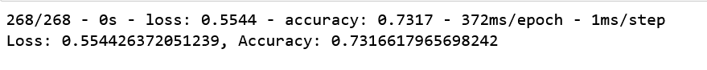
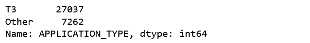
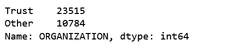
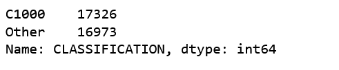
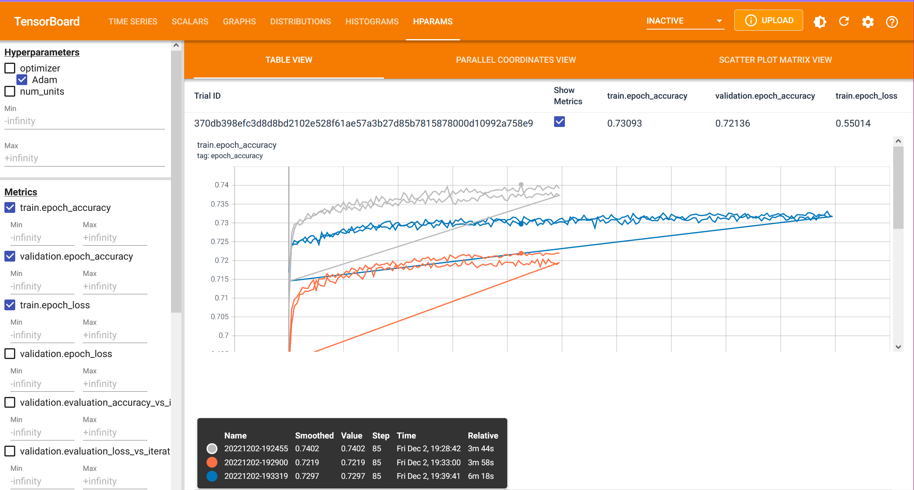
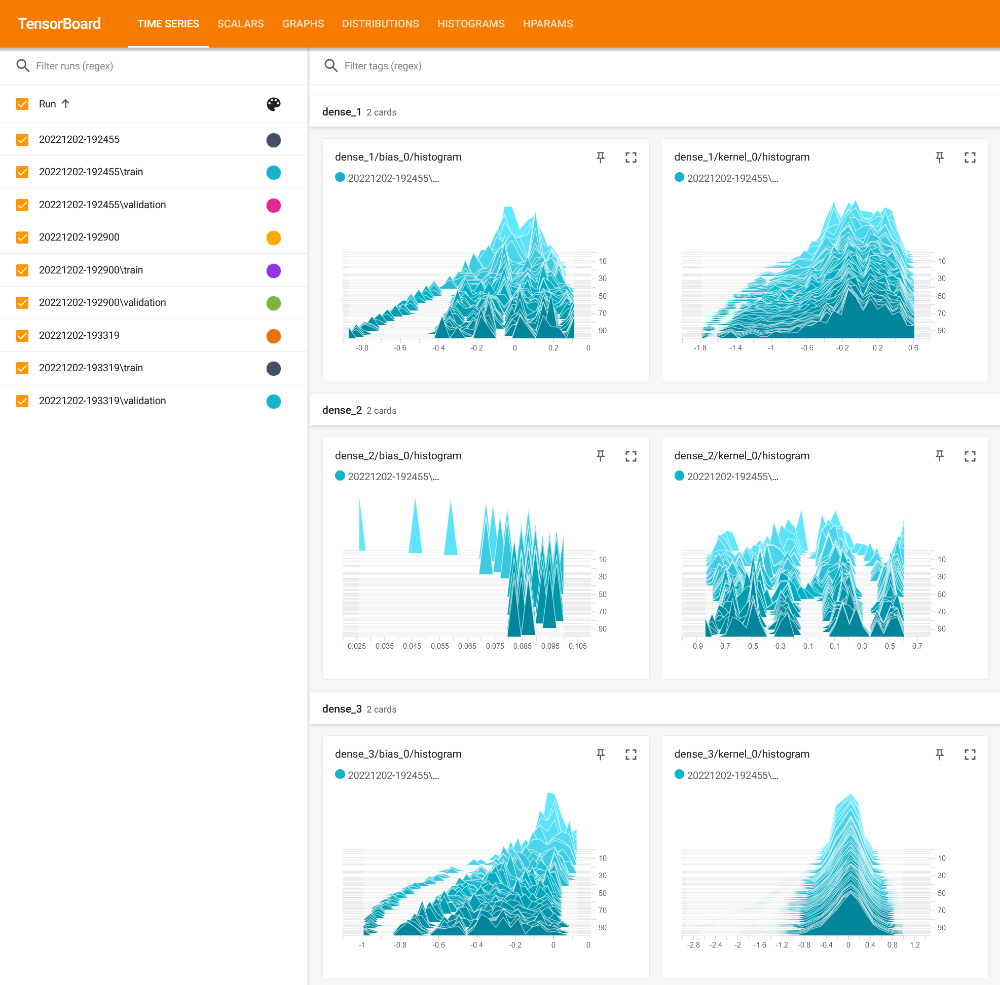

# Neural Network Charity Analysis

## Overview of the Analysis
This analysis focused on developing a Deep Learning Neural Network to assist a charitable organization to decide where to provide financial assistance. 

## Technology
This project included the following technologies:
* Python - The programming language.
* Jupyter Notebook - The web-based interactive computing platform for developing the Python code and executing the analysis.
* Scikit-Learn - Machine Learning tools for Python
* TensorFlow - An open-source software library for machine learning and artificial intelligence.
* TensorBoard - A TensorFlow tool that enables visualization of model performance for parameter selection and optimization, as well as debugging and constructing what-if scenarios.

## Analysis
The analysis took place in two parts.  

The first consisted of an examination of the CSV input data and determiniation of data that required transformation or removal due to non-relevance, the creation of the initial Deep Learning Neural Network, and processing of the data through the model to review its performance.

The input data contained the following information:
        
    EIN and NAME — Identification columns
    APPLICATION_TYPE — Alphabet Soup application type
    AFFILIATION — Affiliated sector of industry
    CLASSIFICATION — Government organization classification
    USE_CASE — Use case for funding
    ORGANIZATION — Organization type
    STATUS — Active status
    INCOME_AMT — Income classification
    SPECIAL_CONSIDERATIONS — Special consideration for application
    ASK_AMT — Funding amount requested
    IS_SUCCESSFUL — Was the money used effectively

For the initial data examiniation, the EIN and NAME columns were immediately removed because they added no relevant data for the Deep Learning model. Categorical data columns were examined and bins were created for rare types of values.  The categorical values were then encoded to enable processing through the model.

An initial "sequential" Keras model was constructed to use two hidden layers with the `relu` (Rectified linear unit) activation function.

Checkpointing was implemented to record the model weight values every five epochs of training operation.

The model processed the input data through 100 epochs of training and the performance was measured to be as follows:

Because the model performance was below the minimum expectation of 75% accuracy, the second part of the analysis was initiated.  This was an examiniation of the model parameters and construction to attempt to identify a way to improve the performance to at least the minimum level.

## Model Optimization Preamble
Given the initial performance of the Deep Learning Neural Net, some experimentation was performed to see if some small changes would enable the model to achieve the minimal accuracy goal.

These small changes resulted in numerous trials with no improvement, and sometimes with decreased accuracy.

Here are the collected results from these attempts:

                hidden_nodes_layer1 = 10
                hidden_nodes_layer2 = 8
                Loss: 0.5545411109924316, Accuracy: 0.7258309125900269

                hidden_nodes_layer1 = 20
                hidden_nodes_layer2 = 10
                Loss: 0.556255042552948, Accuracy: 0.7281632423400879
                ------------------------------------
                Optimization starts:
                ------------------------------------
                hidden_nodes_layer1 = 10
                hidden_nodes_layer2 = 8
                Loss: 0.5541186928749084, Accuracy: 0.7303789854049683
                ------------------------------------
                hidden_nodes_layer1 = 20
                hidden_nodes_layer2 = 10
                Loss: 0.554214596748352, Accuracy: 0.728396475315094
                ------------------------------------
                hidden_nodes_layer1 = 10
                hidden_nodes_layer2 = 10
                hidden_nodes_layer3 = 10
                Loss: 0.5559097528457642, Accuracy: 0.7285131216049194
                ------------------------------------
                hidden_nodes_layer1 = 10
                hidden_nodes_layer2 = 8
                hidden_nodes_layer3 = 6
                Loss: 0.5567770004272461, Accuracy: 0.7285131216049194
                ------------------------------------
                hidden_nodes_layer1 = 10 (Increased size of bins to reduce spread)
                hidden_nodes_layer2 = 8
                hidden_nodes_layer3 = 6
                Loss: 0.5617997050285339, Accuracy: 0.7292128205299377
                ------------------------------------
                hidden_nodes_layer1 = 10 (Maximize bin size
                hidden_nodes_layer2 = 8
                hidden_nodes_layer3 = 6
                Loss: 0.5917598605155945, Accuracy: 0.7071720361709595
                ------------------------------------
                hidden_nodes_layer1 = 10 (Maximize bin size / Change to tanh
                hidden_nodes_layer2 = 8
                hidden_nodes_layer3 = 6
                Loss: 0.5917598605155945, Accuracy: 0.7071720361709595
                ------------------------------------
                (Maximize bin size / Change to tanh / add bins to affiliation, org, and use_case columns)
                hidden_nodes_layer1 = 15 
                hidden_nodes_layer2 = 15
                hidden_nodes_layer3 = 15
                Loss: 0.5903283953666687, Accuracy: 0.707055389881134
                ------------------------------------
                hidden_nodes_layer1 = 10
                hidden_nodes_layer2 = 8
                hidden_nodes_layer3 = 4
                Loss: 0.5900433659553528, Accuracy: 0.7061224579811096
                ------------------------------------
                (change to relu)
                hidden_nodes_layer1 = 10
                hidden_nodes_layer2 = 8
                hidden_nodes_layer3 = 4
                Loss: 0.5915372967720032, Accuracy: 0.7078717350959778
                ------------------------------------
                (change to swish)
                hidden_nodes_layer1 = 10
                hidden_nodes_layer2 = 8
                hidden_nodes_layer3 = 4
                Loss: 0.5896307229995728, Accuracy: 0.7061224579811096
                ------------------------------------
                (change to optimizer='Adadelta' - very fast!)
                hidden_nodes_layer1 = 10
                hidden_nodes_layer2 = 8
                hidden_nodes_layer3 = 4
                Loss: 0.6488712430000305, Accuracy: 0.6853644251823425
                ------------------------------------
                (increase number of epochs -> 500)
                hidden_nodes_layer1 = 10
                hidden_nodes_layer2 = 8
                hidden_nodes_layer3 = 4
                Loss: 0.608311116695404, Accuracy: 0.684198260307312
                ------------------------------------
                hidden_nodes_layer1 = 16
                hidden_nodes_layer2 = 14
                hidden_nodes_layer3 = 12
                hidden_nodes_layer4 = 10
                hidden_nodes_layer5 = 8
                hidden_nodes_layer6 = 6
                Loss: 0.605575680732727, Accuracy: 0.6860641241073608
                ------------------------------------
                Change optimizer back to Adam
                hidden_nodes_layer1 = 16
                hidden_nodes_layer2 = 14
                hidden_nodes_layer3 = 12
                hidden_nodes_layer4 = 10
                hidden_nodes_layer5 = 8
                hidden_nodes_layer6 = 6
                Loss: 0.5936339497566223, Accuracy: 0.7064722776412964
                ------------------------------------
                (drop noisy? columns- 'CLASSIFICATION','AFFILIATION','USE_CASE','ORGANIZATION')
                hidden_nodes_layer1 = 16
                hidden_nodes_layer2 = 14
                hidden_nodes_layer3 = 12
                hidden_nodes_layer4 = 10
                hidden_nodes_layer5 = 8
                hidden_nodes_layer6 = 6
                Loss: 0.5980393290519714, Accuracy: 0.7138192653656006
                ------------------------------------
                (change to relu)
                hidden_nodes_layer1 = 10
                hidden_nodes_layer2 = 10
                hidden_nodes_layer3 = 10
                hidden_nodes_layer4 = 10
                hidden_nodes_layer5 = 10
                hidden_nodes_layer6 = 10
                hidden_nodes_layer7 = 10
                hidden_nodes_layer8 = 10
                ------------------------------------
                (mixed up the activation functions- selu, selu, relu, relu, gelu, gelu, tanh, tanh)
                hidden_nodes_layer1 = 10
                hidden_nodes_layer2 = 10
                hidden_nodes_layer3 = 10
                hidden_nodes_layer4 = 10
                hidden_nodes_layer5 = 10
                hidden_nodes_layer6 = 10
                hidden_nodes_layer7 = 10
                hidden_nodes_layer8 = 10
                Loss: 0.5800519585609436, Accuracy: 0.7102040648460388

After these informal attempts at improving the model accuracy, the TensorBoard data collection was initiated to provide a way of visualizing the changes to the model and to try to use that information for adjustments going forward.

## Model Optimization Attempt 1

For this first optimization attempt, the model was refactored to include instrumented collection of hyperparameter performance data.  This information was recorded into log files for subsequent viewing on TensorBoard.

The model was also updated to vary the number of units (neurons) within the hidden layers, and running multiple trials to collect the data for how this affected performance.  In this case, the model was rerun twice, using both 16 units per layer, and 32 units per layer - using the `relu` activation function within the hidden layers.

## Model Optimization Attempt 2

During the second optimization attempt, the input data binning was modified to attempt to balance the APPLICATION_TYPE data into two main values. This was performed because the column contained 17 classifications, and the combined values of 16 of them were less than the dominant value, as seen below:

For this optimization attempt, the model was updated to include a third hidden layer.  Again the model was run twice for both 16 and 32 units per hidden layer.  This time the model included the `tanh` activation function within the hidden layers.

## Model Optimization Attempt 3

During the third optimization attempt, the input data was further refined to try to remove potentially distracting information.  For example, the STATUS column only contained five "0" values, and the SPECIAL_CONSIDERATIONS column only had 27 "Y" values.  These values did not have conclusive connections to any outcome, so these columns were dropped.  

Binning was again modified to attempt to balance more of the data into two main values, as the AFFILIATION, USE_CASE, ORGANIZATION, and CLASSIFICATION columns each contained a single overwhelmingly dominant value as seen below:

The binning within the AFFILIATION and CLASSIFICATION columns seemed succesful in equalizing the dominant category values.

Finally, the model was updated to include a fourth hidden layer, and to use the `swish` activation function within the hidden layers. (The `swish` activation function has similar characteristics to the `relu` function, but operates at a higher performance.)

This model was run for 200 training epochs, again for both 16 and 32 units per hidden layer.

The additional training epochs were included to see if the model would achieve higher performance with additional training.

## Results

The model did not achieve the minimum expected level of accuracy (75%).

From the TensorBoard charting, we can see that the best performance was barely 74%.

This result was collected during the initial optimization attempt.  From the chart we can see that there was no evidence that the model was progressing towards higher accuracy.  All the indications are that the models will proceed forward in a plateaued fashion.

The data collected during the model operation can be examined in detail within TensorBoard.  Below we can see detail of the hidden layer operations during the first optimization attempt.

The optimization results are available online at this location:

[TensorBoard.dev - Andrew Zinc's experiment](https://tensorboard.dev/experiment/LJl2xuVeSdmytdni5QGjLQ/)

## Conclusions

The Deep Learning model did not achieve the expected accuracy level. 

Perhaps the input data was a factor, as there was no data that provided information about the financial status of the recipient organizations, their abilities to manage the funds, or their budget vs operational funds. Perhaps this information is collected by the Charity organization's application process, but if not, it is recommended for future collection.

Other types of machine learning models may be more successful with this input data, and should be explored going forward.